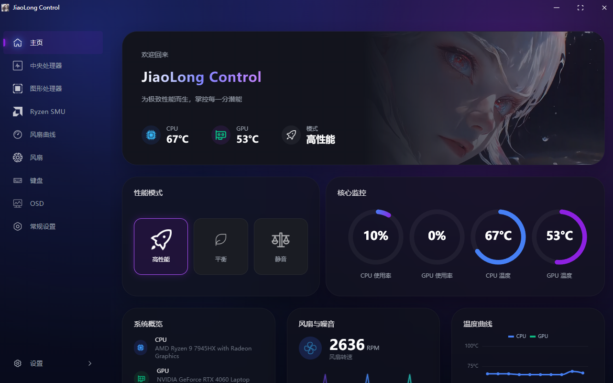

<h1 align="center">JiaoLongControl</h1>

<p align="center">
  <strong>蛟龙 16 PRO 笔记本控制中心</strong><br>
  <em>基于 7945HX + RTX 4060 版本开发，理论兼容其他 16 PRO [2023] 版本</em>
</p>

<p align="center">
  
</p>

<p align="center">
  <a href="https://qm.qq.com/q/4ase4LoAJi">
    
  </a>
  
  
  
  
</p>

---

## 使用说明

1. 从 [Releases](../../releases) 下载最新安装包
2. 运行安装程序（Inno Setup），安装 [PawnIO](https://pawnio.eu/) 运行时（Ryzen SMU 功能依赖）
3. 启动后会在系统托盘显示图标，右键可显示主界面或退出
4. 在系统设置页可配置开机自启和启动最小化；在常规设置页可快捷切换各类锁定状态

> **注意：** 修改硬件参数有一定风险，请确保理解各项设置的含义后再操作。使用前建议备份当前配置。Curve Optimizer 降压过度可能导致死机 / 蓝屏，请从小幅度开始逐核验证。

---

## 开发

```bash
# 前端开发（需要 Node.js 20.19+ / 22.12+）
cd JiaoLongControl/Client
npm install
npm run dev

# 后端构建（需要 .NET 8 SDK，目标平台 x64）
dotnet build JiaoLongControl.sln -p:Platform=x64

# 发布
dotnet publish JiaoLongControl/JiaoLongControl.csproj -c Release
```

- 前端开发时 Vite dev server 运行在 `localhost:5173`，后端 WebView2 在开发模式下指向该地址
- 调试 SMU 功能请安装 PawnIO；EC / 风扇功能依赖随包分发的 `JiaoLongDriver64` 驱动
- 程序清单要求**管理员权限**运行（硬件访问所需）
- 配置文件位于程序目录 `config/config.yaml`，字段含义见文件内注释

---

## 许可证

[MIT](LICENSE.md) © 2025 GaoXanSheng

---

<p align="center">
  <sub>使用风险自负 · 非官方工具 · 与机械革命/清华同方无关联</sub>
</p>
